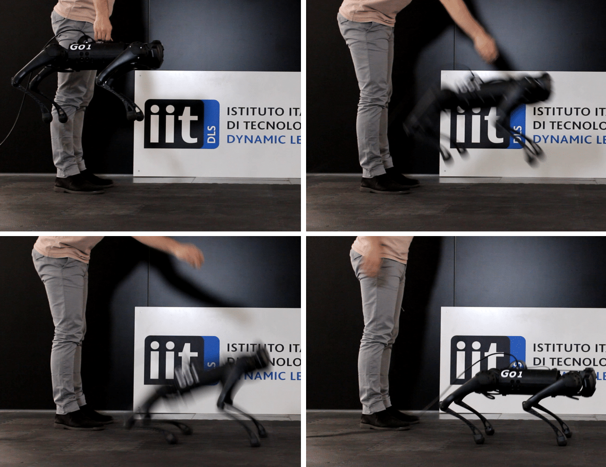

# Reactive Landing Controller for Quadruped Robots

Francesco Roscia, Michele Focchi, Andrea Del Prete, Darwin G. Caldwell, and Claudio Semini

Corresponding author's email: francesco.roscia@iit.it

<p align="center">
     
</p>

This repository is a reduced version of [Locosim](https://github.com/mfocchi/locosim) 
([preprint](https://arxiv.org/abs/2305.02107)) and it is intended for reproducing simulations and experiments
presented in the manuscript [Reactive Landing Controller for Quadruped Robots](https://www.todo.todo/).

The Reactive Landing Controller addresses the problem of landing on a flat horizontal surface for a quadruped robot.
It has been designed for satisfying the following requirements:

**(R1)** no bounces after landing;

**(R2)** the trunk must not hit the ground;

**(R3)** the robot must reach a stable standing state;

**(R4)** once landed, the feet must not slip.

It uses only proprioceptive measures for torque-controlled quadruped robots, without requiring prior knowledge of either
the distance to the landing surface or the flight time.

Check out our Youtube [video](https://www.youtube.com/watch?v=KnmNbhkOKWI).

<p align="center">
  
</p>

## Install Locosim

Locosim is composed by a **roscontrol** node called **ros_impedance_controller** (written in C++) that interfaces the 
Python ros node (where the controller is written) to a Gazebo simulator.

### SOFTWARE VERSIONS:

Locosim is compatible with Ubuntu 16/18/20. The installation instructions have been generalized accordingly. 
You need replace few strings with the appropriate values according to your operating systems as follows:

| **Ubuntu 16**:               | Ubuntu 18:                   | **Ubuntu 20**:               |
| ---------------------------- | ---------------------------- | ---------------------------- |
| PYTHON_PREFIX = Python       | PYTHON_PREFIX = Python3      | PYTHON_PREFIX = Python3      |
| PYTHON_VERSION = 2.7         | PYTHON_VERSION = 3.5         | PYTHON_VERSION = 3.8         |
| ROBOTPKG_PYTHON_VERSION=py27 | ROBOTPKG_PYTHON_VERSION=py35 | ROBOTPKG_PYTHON_VERSION=py38 |
| PIP_PREFIX = pip             | PIP_PREFIX = pip3            | PIP_PREFIX = pip3            |
| ROS_VERSION = kinetic        | ROS_VERSION = bionic         | ROS_VERSION = noetic         |

**NOTE:** ROS is no longer supported on Ubuntu 22 (only ROS2) hence is not possible to install Locosim on Ubuntu 22.

### Install ROS 

setup your source list:

```
sudo sh -c 'echo "deb http://packages.ros.org/ros/ubuntu $(lsb_release -sc) main" > /etc/apt/sources.list.d/ros-latest.list'
```

Set up your keys:

```
curl -sSL 'http://keyserver.ubuntu.com/pks/lookup?op=get&search=0xC1CF6E31E6BADE8868B172B4F42ED6FBAB17C654' | sudo apt-key add -
```

install ROS main distro:

```
sudo apt-get install ros-ROS_VERSION-desktop-full
```

install ROS packages:

```
sudo apt-get install ros-ROS_VERSION-urdfdom-py
```

```
sudo apt-get install ros-ROS_VERSION-srdfdom
```

```
sudo apt-get install ros-ROS_VERSION-joint-state-publisher
```

```
sudo apt-get install ros-ROS_VERSION-joint-state-publisher-gui
```

```
sudo apt-get install ros-ROS_VERSION-joint-state-controller 
```

```
sudo apt-get install ros-ROS_VERSION-gazebo-msgs
```

```
sudo apt-get install ros-ROS_VERSION-control-toolbox
```

```
sudo apt-get install ros-ROS_VERSION-gazebo-ros
```

```
sudo apt-get install ros-ROS_VERSION-controller-manager
```

```
sudo apt install ros-ROS_VERSION-joint-trajectory-controller
```


#### Pinocchio stuff

**Add robotpkg as source repository to apt:**

```
sudo sh -c "echo 'deb [arch=amd64] http://robotpkg.openrobots.org/packages/debian/pub $(lsb_release -sc) robotpkg' >> /etc/apt/sources.list.d/robotpkg.list"
```

```
sudo sh -c "echo 'deb [arch=amd64] http://robotpkg.openrobots.org/wip/packages/debian/pub $(lsb_release -sc) robotpkg' >> /etc/apt/sources.list.d/robotpkg.list"
```

**Register the authentication certificate of robotpkg:**

```
sudo apt install -qqy lsb-release gnupg2 curl
```

```
curl http://robotpkg.openrobots.org/packages/debian/robotpkg.key | sudo apt-key add -
```

You need to run at least once apt update to fetch the package descriptions:

```
sudo apt-get update
```

Now you can install Pinocchio and the required libraries:

```
sudo apt install robotpkg-PINOCCHIO_PYTHON_VERSION-eigenpy	
```

```
sudo apt install robotpkg-PINOCCHIO_PYTHON_VERSION-pinocchio
```

```
sudo apt-get install robotpkg-PINOCCHIO_PYTHON_VERSION-quadprog  
```

**NOTE:** If you have issues in installing robotpkg libraries you can try to install them through ROS as:

```
sudo apt-get install ros-ROS_VERSION-LIBNAME
```


###  Python

```
sudo apt-get install PYTHON_PREFIX-scipy
```

```
sudo apt-get install PYTHON_PREFIX-matplotlib
```

```
sudo apt-get install PYTHON_PREFIX-termcolor
```

```
sudo apt install Python3-pip
```


### Download code and setup ROS workspace

Now that you installed all the dependencies you are ready to get the code, but first you need to create a ros workspace to out the code in:

```
mkdir -p ~/ros_ws/src
```

```
cd ~/ros_ws/src
```

Now you need to call the following line manually (next you will see that it will be done automatically in the .bashrc)

```
source /opt/ros/ROS_VERSION/setup.bash
```

```
cd ~/ros_ws/
```

```
 catkin_make
```

```
 cd ~/ros_ws/src/ 
```

Now you can clone the repository inside the ROS workspace you just created:

```
git clone https://github.com/mfocchi/climbing_robots.git
```

now recompile again (then this step won't bee needed anymore if you just work in Python unless you do not modify / create additional ROS packages)

```
cd ~/ros_ws/ 
```

```
 catkin_make install
```

the install step install the ros packages inside the "$HOME/ros_ws/install" folder rather than the devel folder. This folder will be added to the ROS_PACKAGE_PATH instead of the devel one.

Finally, run (you should do it any time you add a new ros package)

```
 rospack profile
```

There are some additional utilities that I strongly suggest to install. You can find the list  [here](https://github.com/mfocchi/locosim/blob/develop/utils.md).


### Configure environment variables 

```
gedit  ~/.bashrc
```

copy the following lines (at the end of the .bashrc), remember to replace the string PYTHON_VERSION with the appropriate version name as explained in [software versions](#software-versions) section:

```
source /opt/ros/ROS_VERSION/setup.bash
source $HOME/ros_ws/install/setup.bash
export PATH=/opt/openrobots/bin:$PATH
export LOCOSIM_DIR=$HOME/ros_ws/src/reactive_landing_controller
export PYTHONPATH=/opt/openrobots/lib/PythonPYTHON_VERSION/site-packages:$PYTHONPATH
export PYTHONPATH=$LOCOSIM_DIR/robot_control:$PYTHONPATH
export PYTHONPATH=$LOCOSIM_DIR/landing_controller:$PYTHONPATH
export ROS_PACKAGE_PATH=$ROS_PACKAGE_PATH:/opt/openrobots/share/
```

The .bashrc is a file that is **automatically** sourced whenever you open a new terminal.

**NOTE**: people with some operating systems like ARCH LINUX, might need to add "export ROS_IP=127.0.0.1" to the .bashrc.

#### Compile/Install the code

Whenever you modify some of the ROS packages (e.g. the ones that contain the xacro fles inside the robot_description folder), you need to install them to be sure they are been updated in the ROS install folder. 

```
cd ~/ros_ws/ 
```

```
 catkin_make install 
```

**IMPORTANT!**

The first time you compile the code the install folder is not existing, therefore won't be added to the PYTHONPATH with the command **source $HOME/ros_ws/install/setup.bash**, and you won't be able to import the package ros_impedance_controller. Therefore, **only once**, after the first time that you compile, run again :

```
source .bashrc
```


### **Running the software** from Python IDE: Pycharm  

We recommend to use an IDE to run and edit the Python files, like Pycharm community. To install it,  you just need to download and unzip the program:

https://download.jetbrains.com/Python/pycharm-community-2021.1.1.tar.gz

 and unzip it  *inside* the home directory. 

We ask you to download this specific version (2021.1.1) that we am sure it works: newer versions seem to be failing to load environment variables. 

To be able to keep the plots **alive** at the end of the program and to have access to variables,  you need to "Edit Configurations..." and tick "Run with Python Console". Otherwise the plot will immediately close. 


### Running the Software from terminal

To run from a terminal we  use the interactive option that allows  when you close the program have access to variables:

```
$ Python3 -i $LOCOSIM_DIR/robot_control/base_controllers/climbingrobot_controller.py
```

to exit from Python3 console type CTRL+Z


### Tips and Tricks 

1) Some machines, do not have support for GPU. This means that if you run Gazebo Graphical User Interface (GUI) it can become very **slow**. A way to mitigate this is to avoid to start the  Gazebo GUI and only start the gzserver process that will compute the dynamics, you will keep the visualization in Rviz. This is referred to planners that employ BaseController or BaseControllerFixed classes. In the Python code where you start the simulator you need to pass this additional argument as follows:

```
additional_args = 'gui:=false'
p.startSimulator(..., additional_args =additional_args)
```

2) Another annoying point is the default timeout to kill Gazebo that is by default very long. You can change it (e.g. to 0.1s) by setting the  _TIMEOUT_SIGINT = 0.1 and _TIMEOUT_SIGTERM = 0.1:

```
sudo gedit /opt/ros/ROS_VERSION/lib/PYTHON_PREFIX/dist-packages/roslaunch/nodeprocess.py
```

 this will cause ROS to send a `kill` signal much sooner.

3) if you get this annoying warning: 

```
Warning: TF_REPEATED_DATA ignoring data with redundant timestamp for frame...
```

a dirty hack to fix it is to clone this repository in your workspace:

```
git clone --branch throttle-tf-repeated-data-error git@github.com:BadgerTechnologies/geometry2.git
```

## Other informations
### Save simulation videos
If you want to record video of the simulations, you must:

1. install ffmpeg (https://ffmpeg.org/)
2. initialize Gazebo with camera_slow.world

If you do not want to run the Gazebo client, you can add `'gui:=False'` as additional argument.

`p.startController(world_name='camera_slow.world', additional_args=['gui:=False'])`

### Compile and install SLIP_dynamics_lib.so
If you need to create compile and install SLIP_dynamics_lib.so, you first need to download and install
[Boost](https://www.boost.org/doc/libs/1_82_0/libs/bind/doc/html/bind.html). 
Then, you must type
```bash
cd landing_controller/controller/SLIP_dynamics
mkdir build & cd build
cmake ..
make install
```
SLIP_dynamics_lib.so will be installed in `landing_controller/controller` folder. 
Please move it to `landing_controller/lib`. It is imported by `landingController.py`. 

### Use Go1 
Locosim simplifies the use of Go1. The `robot_hardware_interface` folder contains what you need for communicating to the
robot. Please refer to [setupGo1.md](setupGo1.md) for turning on the robot. In `landing_controller/go1tests` there are some toy example
describing how to use Locosim with the Go1 hardware.

